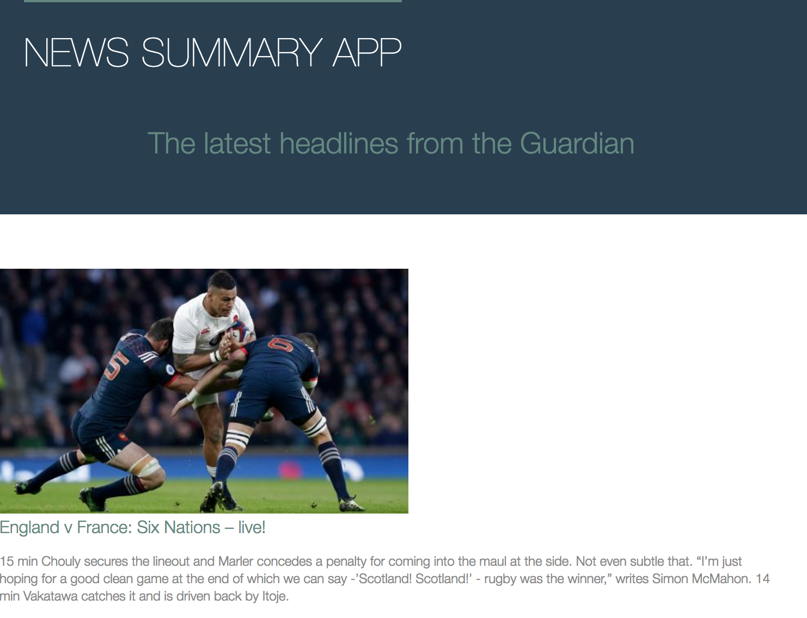
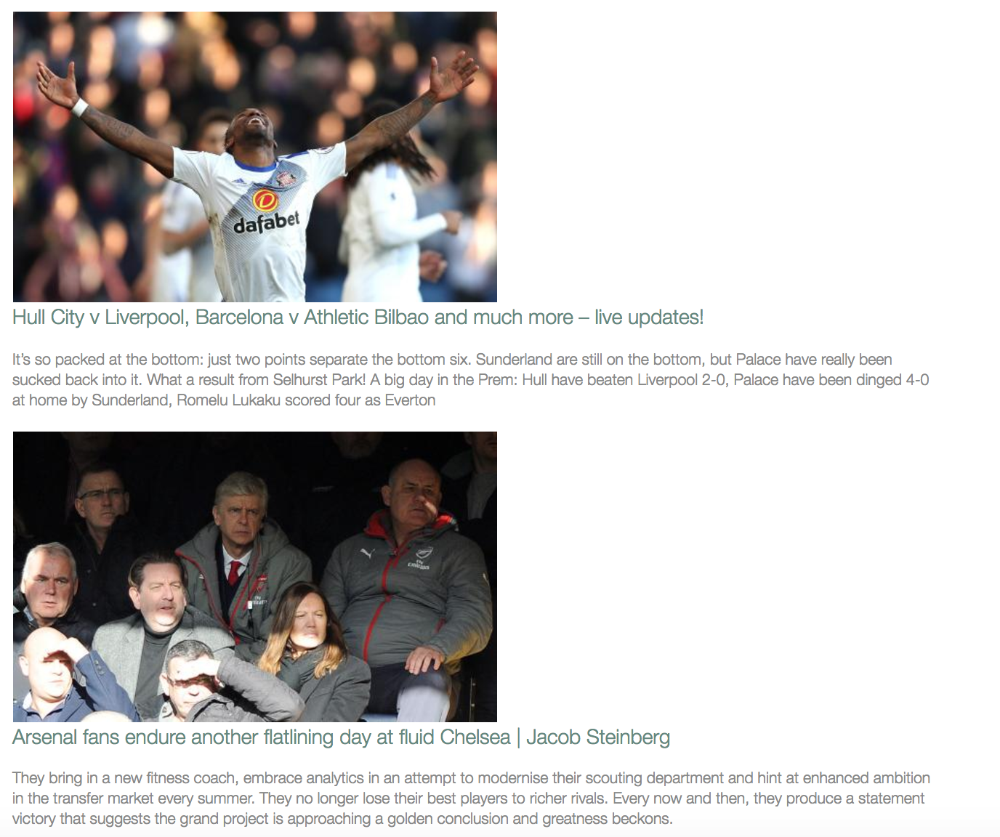

# News Summary App

Description
===========

Single Page web app that displays the summary of the current news.

User Stories
============

```
As a busy politician
I can see all of the day's headlines in one place
So I know what the big stories of the day are.

As a busy politician
I can read a summary of a news article
So I can get a few more details about an important story

As a busy politician
I can read a full news article
So that I can get an in depth understanding of a very important story

As a busy politician
I can see a picture to illustrate each news article when I browse headlines
So that I have something nice to look at

As a busy politician
I can read the site comfortably on my phone
Just in case my laptop breaks

As a busy politician
I can see whizzy animations in the App
To make my news reading more fun
```

Approach and Technologies used
==============================

* Code and testing written using Javascript
* HTML for markup, CSS for styling
* [Guardian API](http://open-platform.theguardian.com/documentation/)

The project uses the following classes:

**Article** responsible for a single article defined by a headline, url and image.

**ArticleList** responsible for storing all of the articles.

**ArtcleListView** responsible for formatting the contents of the article list into a HTML view.

**ArticleController**  responsible for displaying the formatted HTML onto the main index page.

**CurrentArticles** responsible for fetching the current headlines from the Guardian API.


Setup and Installation
======================

1. Fork and Clone the repo.
2. open index.html in a browser.

Screenshots
===========





Further features to Implement
=============================

* Make web page responsive on Mobile devices
